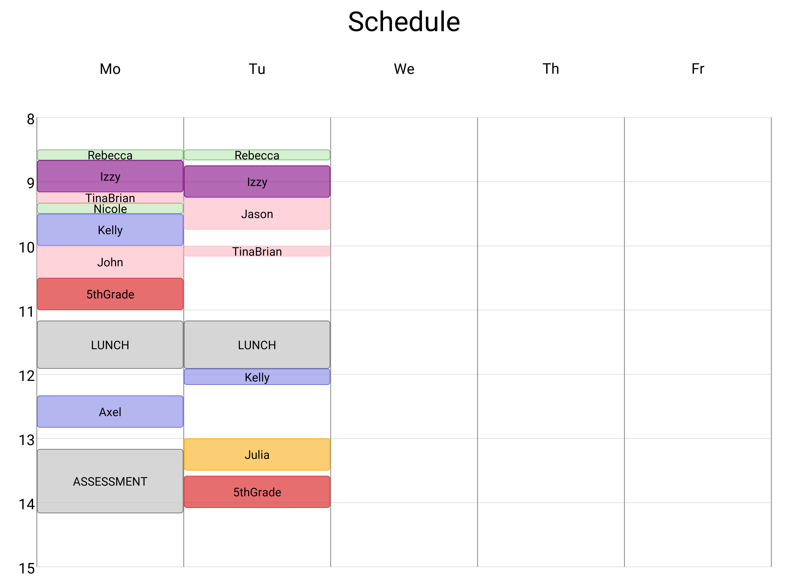

# caseload-scheduling

This package is a Python-based tool for designing optimal weekly schedules for a
**caseload**. 

A **caseload** is defined as a set of appointments with a prescribed
duration (e.g., 30 min) that can be scheduled in a particular set of available time
slots (e.g., Mon 9:30 AM - 1:00 PM, Tue 9:30 AM - 1:00 PM, etc.). This applies to
therapists, social workers, doctors, or other professionals attempting to see multiple
clients, each of whom has their own scheduling constraints.

The problem is solved using a mixed-integer linear programming (MLIP) approach
with the `pyomo` package, with the default HiGHS solver (installed via `highspy`).

The default **objective function** maximizes the number of cases scheduled in the week, making
this package particularly suitable for scheduling very large caseloads.

## Installation

Simply clone the repository and install the package using pip. Navigate to the root directory 
of the package and type: 

```
pip install -e .
```
The -e flag denotes an editable install for development.

The code will be importable using the package name `csched`.

## Usage

A script has been provided to demonstrate the usage of the package, located at
scripts/solve.py.

One should edit the provided cases and sessions data files (see `data/cases.xlsx` and
`data/sessions.xlsx`). Follow the example format (e.g., NAME_NUM for each case).

The script can then be run by executing the following command from the root directory of
the repository:

```
python scripts/solve.py
```

The script will generate results in the `results` directory, including a spreadsheet
summarizing the assigned times (`results.xlsx`) and a schedule plot on a weekly
calendar view (`calendar.png`). The schedule will look something like this:



## Acknowledgements

This package was developed by Matt McDermott (@mattmcdermott) and inspired by Lewis Woolfson's repository:

<https://github.com/Lewisw3/theatre-scheduling>
